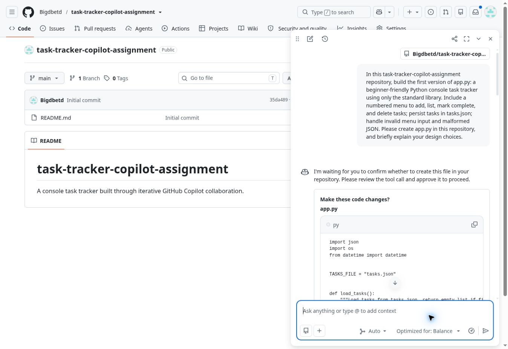
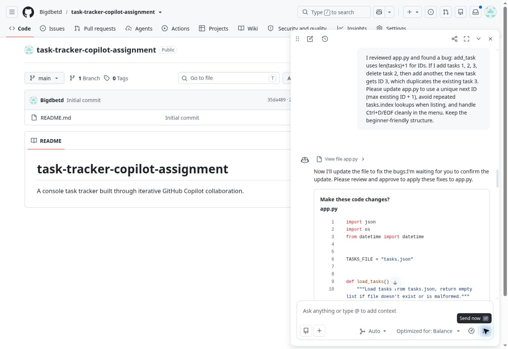
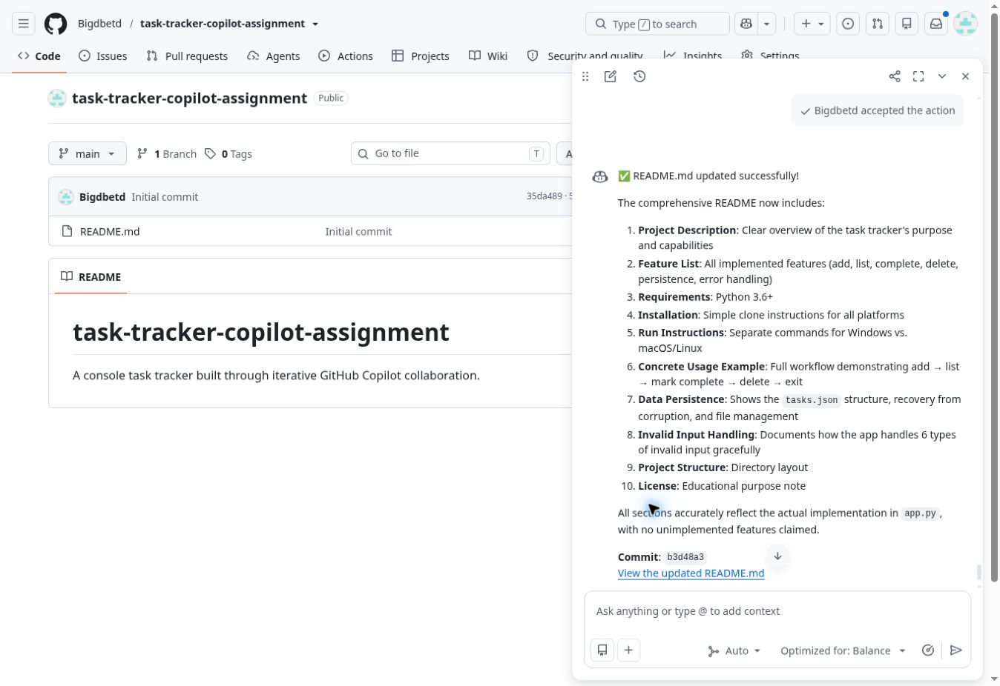

# Reflection: Building a Task Tracker with GitHub Copilot

## What I asked Copilot to build and how I broke it down

I chose a Python console task tracker because it has a small, useful interface and fits the course's suggested beginner stack. I first asked GitHub Copilot to create `app.py` with a numbered menu for adding, listing, completing, and deleting tasks. The prompt also specified standard-library-only code, JSON persistence, and invalid-input handling. I accepted its proposed file in the repository, then ran the program locally. After inspecting the behavior, I asked for a focused fix to task IDs and EOF handling. Finally, I asked Copilot to generate the README based on the actual app, and then to correct specific documentation claims.

## How my prompts changed

My first prompt described the entire minimum viable application. Later prompts became more precise and testable. For example, I pointed out the exact sequence “add IDs 1, 2, 3; delete 2; add another” to show why `len(tasks) + 1` could duplicate ID 3. I asked for `max(existing ID) + 1`, a simpler listing loop, and graceful EOF at the menu. This was more useful than a broad request to “fix bugs,” because Copilot could see the failing scenario and the desired result.

## What surprised me

Copilot could propose a complete working program and make changes directly in the GitHub repository after I reviewed and accepted them. It also generated detailed documentation quickly. At the same time, its first code draft had the duplicate-ID flaw, and its first README described completion as a toggle even though the app only marks tasks done. The documentation also assumed `tasks.json` would always sit beside `app.py`; the code actually uses the current working directory. Reviewing both code and prose mattered.

## What I learned about the technology

The Python `json` module can persist a list of task dictionaries across separate runs without an external database. The program calls `json.dump` after changes and `json.load` at startup. I learned that a relative filename like `tasks.json` resolves from the process's current working directory. I also saw how task IDs and list positions differ: deleting the middle task leaves a gap in IDs, which is fine as long as the next ID stays unique. Catching `JSONDecodeError` prevents corrupted saved data from crashing the menu, though the user should back up valuable data before continuing.

## What I would do differently

Next time, I would include acceptance checks in the first prompt, especially add–delete–add, persistence across a restart, empty descriptions, malformed JSON, and EOF. I would ask Copilot for a small test plan before accepting the code, then run it and report exact observations. For a larger project I would also separate storage from the console interface and decide whether tasks should be saved beside the script or in an explicit user data folder. This exercise showed that directing Copilot works best as a cycle of specific requests, hands-on checks, and targeted revisions.

## Verification performed

I ran the menu through adding three tasks, deleting the middle one, adding another, listing tasks, marking a task complete, and exiting. The saved IDs were `1`, `3`, and `4` with the last task completed. I restarted the app and confirmed it loaded the saved tasks. I also checked malformed JSON and an EOF at the main menu. These checks passed after the Copilot revision.
